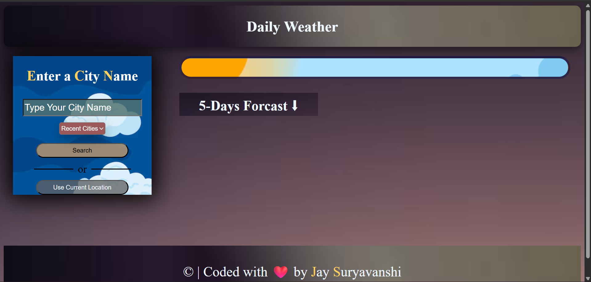
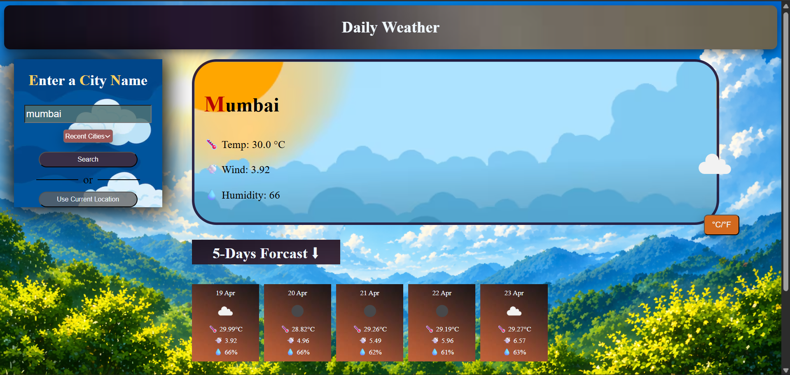
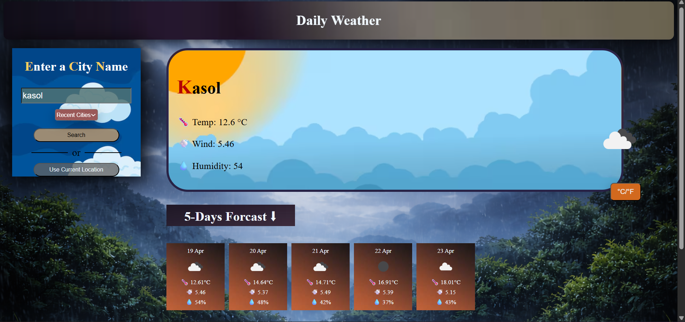

 🌦️ Daily Weather Project

A dynamic and responsive "Daily Weather Forecast Web Application" built using HTML, CSS, and JavaScript.
This app provides real-time weather updates with interactive UI and smart background changes.

---------------------------------------------------------------

 🚀 Features

* 🔍 Search weather by city name
* 📍 Get weather using current location
* 🌡️ Temperature toggle (Celsius ↔ Fahrenheit)
* 🎥 Dynamic background (changes based on temperature/weather)
* 🕘 Recent searched cities dropdown
* 🎨 Smooth UI with hover effects & transitions
* 📊 Weather forecast display

---------------------------------------------------------------------

 🛠️ Tech Stack
 
* HTML
* CSS
* JavaScript 
* OpenWeather API

--------------------------------------------------------------------------

 📂 Project Structure
 
Daily-Weather-Project/
│── index.html
│── index.css
│── index.js
│── img2.avif
│── img4.avif
│── r1.png
│── rrrrrr.jpg
│── s1.png
│── s2.png
│──imagesscreenshot.png
│──imagesscreenshot1.png
│──imagesscreenshot2.png


------------------------------------------------------------------------------------

 ⚙️ How to Run

1. Download or clone this repository
2. Open `index.html` in your browser
3. Enter city name or use location

-----------------------------------------------------------------------------------

🔑 API Setup

Replace your API key in `index.js`:

```javascript
const API_KEY = "your_api_key_here";
```

--------------------------------------------------------------------------------------

 📸 Screenshots

 🏠 Main Interface


1). 🌦️  Result when weather is hot
 

2).🌦️ Result when weather is cool


---------------------------------------------------------------------------------------

 🌍 Future Improvements

* 🌙 Dark/Light mode
* 📊 Hourly forecast
* 💾 Save favorite cities

---------------------------------------------------------------------------------------

👨‍💻 Author

Jay Suryavanshi
GitHub: https://github.com/Jaysuryvanshi


---------------------------------------------------------------------------------------
🌐 Live Demo

👉 Access the project here:
🔗 https://jaysuryvanshi.github.io/Daily-Weather-Project/

You can open the link above to explore the application and test all features in real time.

---------------------------------------------------------------------------------------
 📜 License

This project is open-source and available in my github account (Jaysuryvanshi)
